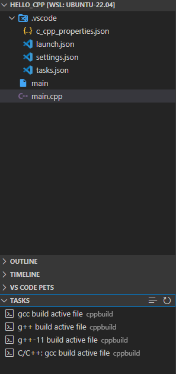

# Fast Tasks

Fast Tasks is a VS Code extension that provides quick access to your workspace tasks directly from the activity bar.

## Features

- Dedicated tasks view in the activity bar
- One-click task execution
- Task type information display
- Quick task refresh capability

## Usage

1. Click on the Tasks icon in the activity bar (looks like a checklist)
2. View all available tasks in your workspace
3. Click on any task to run it
4. Use the refresh button to update the task list

## Requirements

- Visual Studio Code version 1.95.0 or higher
- A workspace with defined tasks (in tasks.json or workspace files)
